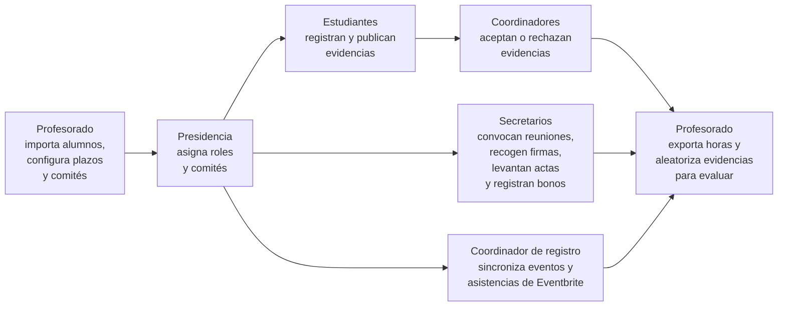

# Guía de uso de Evidentia

**Evidentia** ([evidentia.us.es](https://evidentia.us.es)) es la plataforma con la que se registra, valida y contabiliza el trabajo realizado por el alumnado en las **Jornadas InnoSoft Days**, organizadas en el marco de la asignatura *Evolución y Gestión de la Configuración* (EGC) de la ETSII, Universidad de Sevilla.

Esta guía está escrita para las personas que **usan** la aplicación: estudiantes, coordinadores y secretarios de comité, coordinador de registro, presidencia y profesorado. No es documentación técnica ni de despliegue.

> Guía correspondiente a la versión **3.3.4** de Evidentia.

## Índice

| Capítulo | Contenido |
|---|---|
| [1. Introducción y conceptos clave](docs/01-introduccion.md) | Qué es Evidentia, comités, evidencias, horas computadas, plazos y sellos de integridad |
| [2. Acceso, panel principal y perfil](docs/02-acceso-y-perfil.md) | Primer acceso, contraseña, panel principal, menú lateral, *Mi perfil*, ayuda |
| [3. Roles y permisos](docs/03-roles.md) | Qué puede hacer cada rol y cómo se asignan |
| [4. Guía del estudiante](docs/04-estudiante.md) | Crear, publicar, editar y corregir evidencias; reuniones; asistencias; firmar asistencia; resumen de trabajo |
| [5. Guía del coordinador de comité](docs/05-coordinador.md) | Revisar, aceptar y rechazar evidencias |
| [6. Guía del secretario de comité](docs/06-secretario.md) | Convocatorias, hojas de firmas, actas, bonos de horas y listas |
| [7. Guía del coordinador de registro](docs/07-coordinador-registro.md) | Eventos y asistencias con Eventbrite |
| [8. Guía de presidencia y profesorado](docs/08-presidencia-y-profesorado.md) | Configurar el curso, gestionar alumnos, comités, evidencias, reuniones, importaciones y exportaciones |
| [9. Preguntas frecuentes](docs/09-preguntas-frecuentes.md) | Problemas habituales y cómo resolverlos |
| [10. Glosario](docs/10-glosario.md) | Términos y estados que aparecen en la aplicación |

## ¿Por dónde empiezo?

| Si eres... | Lee primero |
|---|---|
| Estudiante | [2. Acceso](docs/02-acceso-y-perfil.md) y [4. Guía del estudiante](docs/04-estudiante.md) |
| Coordinador/a de un comité | [4. Guía del estudiante](docs/04-estudiante.md) (para tus propias evidencias) y [5. Guía del coordinador](docs/05-coordinador.md) |
| Secretario/a de un comité | [6. Guía del secretario](docs/06-secretario.md) |
| Coordinador/a de registro | [7. Guía del coordinador de registro](docs/07-coordinador-registro.md) |
| Presidente/a de las jornadas | [8. Guía de presidencia y profesorado](docs/08-presidencia-y-profesorado.md) |
| Profesor/a | [1. Introducción](docs/01-introduccion.md) y [8. Guía de presidencia y profesorado](docs/08-presidencia-y-profesorado.md) |

## El flujo de trabajo en seis pasos

1. El **profesorado** importa el listado de alumnos, configura las fechas límite del curso y revisa los comités.
2. La **presidencia** (o el profesorado) asigna a cada persona sus roles y su comité.
3. Cada **estudiante** registra sus evidencias de trabajo, adjunta pruebas y las publica.
4. El **coordinador** de cada comité revisa las evidencias recibidas y las acepta o las rechaza indicando el motivo.
5. El **secretario** de cada comité convoca las reuniones, recoge las firmas de asistencia, levanta acta y registra bonos de horas.
6. El **coordinador de registro** sincroniza los eventos y las asistencias desde Eventbrite.
7. Al cierre, el profesorado exporta las horas computadas de cada estudiante y selecciona al azar una evidencia por persona para su evaluación.

## Soporte

- Grupo de asistencia técnica en Telegram: [t.me/evidentia_sat](https://t.me/evidentia_sat)
- Dentro de la aplicación: menú **Opciones → Buzón de sugerencias** (anónimo)
- Código fuente de Evidentia: [github.com/drorganvidez/evidentia](https://github.com/drorganvidez/evidentia) (licencia GNU GPL v3)
