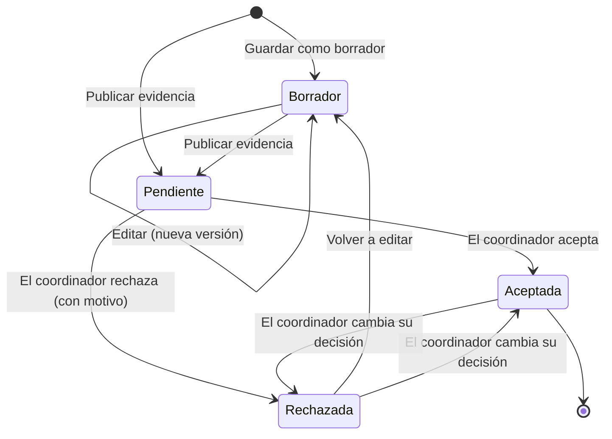

# 1. Introducción y conceptos clave

[← Volver al índice](../README.md)

## ¿Qué es Evidentia?

Evidentia es la herramienta con la que se documenta el trabajo de cada estudiante en las Jornadas InnoSoft Days. Cada persona registra en ella lo que ha hecho (sus **evidencias**), adjunta pruebas y las envía a revisión. Los coordinadores de comité validan ese trabajo, los secretarios levantan acta de las reuniones y el profesorado obtiene al final un cómputo de horas por estudiante.

Todo lo que se registra en Evidentia forma parte de la evaluación de la asignatura. Por eso es importante conocer cómo funciona, qué plazos hay y qué se espera de cada rol.

## Comités

Las jornadas se organizan en **comités**. Cada comité tiene un nombre y un icono, y normalmente cuenta con un **coordinador** (que valida las evidencias dirigidas a ese comité) y un **secretario** (que gestiona sus reuniones y bonos).

Por defecto existen estos comités, aunque el profesorado o la presidencia pueden crear, renombrar o eliminar comités:

| Comité |
|---|
| Presidencia |
| Secretaría |
| Programa |
| Igualdad |
| Sostenibilidad |
| Finanzas |
| Logística |
| Comunicación |
| I+D+I |

Cada evidencia se asocia a **un** comité. Una misma persona puede enviar evidencias a distintos comités.

## Evidencias

Una **evidencia** es la unidad básica de trabajo en Evidentia. Describe una tarea concreta que has realizado y consta de:

- un **título**,
- las **horas** (y minutos) dedicadas,
- el **comité** al que va dirigida,
- una **descripción** detallada, y
- opcionalmente, **pruebas adjuntas** (documentos, imágenes, archivos comprimidos...).

Una evidencia pasa por varios estados a lo largo de su vida:

| Estado | Significado |
|---|---|
| **En borrador** | Solo la ves tú. Puedes editarla cuantas veces quieras. No cuenta horas. |
| **Pendiente de revisión** | Ya la has publicado y el coordinador de tu comité puede verla. No se puede editar mientras está en revisión. No cuenta horas todavía. |
| **Aceptada** | El coordinador la ha validado. **Sus horas se suman a tu cómputo.** |
| **Rechazada** | El coordinador la ha rechazado e indica el motivo. Puedes volver a editarla y publicarla de nuevo. No cuenta horas. |

Solo las evidencias **aceptadas** cuentan para las horas.

## Horas computadas

Evidentia calcula automáticamente el total de horas de cada estudiante como la suma de cuatro fuentes:

| Fuente | Quién la registra | Cómo se obtiene |
|---|---|---|
| **Horas en evidencias** | El propio estudiante | Suma de las horas de tus evidencias **aceptadas** |
| **Horas en reuniones** | El secretario del comité | Duración de las reuniones en cuya acta apareces como asistente |
| **Horas en eventos** | El coordinador de registro (desde Eventbrite) | Duración de los eventos en los que constas como **asistido** (check-in realizado) |
| **Horas bonificadas** | El secretario del comité | Bonos de horas que un secretario te haya asignado |

Este desglose aparece en tu panel principal y en tu perfil. Es el mismo cómputo que el profesorado exporta al final de las jornadas.

## Plazos (fechas límite)

El profesorado o la presidencia configuran cinco fechas límite para el curso. Se muestran en el panel principal de todas las personas y, en cada sección, con una cuenta atrás.

| Plazo | Qué ocurre cuando vence |
|---|---|
| **Subida de evidencias** | Los estudiantes ya no pueden crear, editar, volver a publicar ni borrar evidencias. Solo consultarlas. |
| **Validación de evidencias** | Los coordinadores ya no pueden aceptar ni rechazar evidencias. |
| **Registro de reuniones** | Fecha de referencia para que los secretarios tengan registradas las actas. |
| **Registro de bonos** | Los secretarios ya no pueden crear, editar ni borrar bonos de horas. |
| **Importación de eventos y asistencias** | El coordinador de registro ya no puede cargar eventos ni asistencias desde Eventbrite. |

> **Consejo:** no apures los plazos. Una evidencia rechazada el último día no se podrá corregir a tiempo, y una revisión hecha con prisas puede contener errores.

## Sellos de integridad

Cada evidencia y cada archivo adjunto reciben, al guardarse, un **sello** calculado a partir de su contenido. El profesorado dispone de una herramienta para comprobar que ninguna evidencia ni prueba ha sido manipulada después de su registro. Como usuario no tienes que hacer nada: el sello se genera y se comprueba automáticamente.

## Versión de la aplicación

En la barra superior aparece la versión del software en uso (por ejemplo, `v3.3.4`). En el menú **Opciones → Actualizaciones** puedes consultar el historial de versiones publicadas y las incidencias abiertas, siempre que la aplicación pueda conectar con el repositorio del proyecto.
