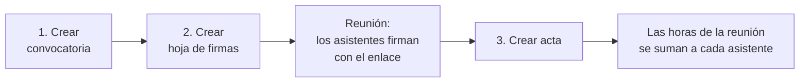

# 6. Guía del secretario de comité

[← Volver al índice](../README.md)

Como secretario, documentas la **actividad de tu comité**: convocas las reuniones, recoges las firmas de asistencia, levantas las actas y, cuando procede, registras **bonos de horas**. Las horas de reunión y los bonos que registras se suman directamente al cómputo de cada estudiante, por lo que tu trabajo tiene efecto directo en la evaluación.

Todo lo que necesitas está en el bloque **REUNIONES Y BONOS** del menú lateral:

- **Gestionar reuniones**
- **Gestionar bonos**
- **Gestionar listas**

Si además eres estudiante, tus propias evidencias las gestionas desde **MIS COSAS** ([capítulo 4](04-estudiante.md)).

## El ciclo de una reunión

**Gestionar reuniones** resume estos pasos y da acceso a crear y consultar cada tipo de elemento:

| Crear | Consultar |
|---|---|
| Crear convocatoria | Mis convocatorias |
| Crear hoja de firmas | Mis hojas de firmas |
| Crear acta | Mis actas |

Los tres elementos son independientes: puedes levantar un acta sin convocatoria ni hoja de firmas. Pero si sigues el orden completo, el acta se rellena sola con los datos de la convocatoria y con las firmas recogidas.

## 1. Convocatorias

Una **convocatoria** anuncia una reunión y fija su orden del día. Al crearla, Evidentia genera un **PDF** con el formato oficial de las jornadas que puedes descargar y distribuir. La reunión aparece además en el bloque **Próximas reuniones** del panel principal de todos los usuarios.

### Crear una convocatoria

1. **Gestionar reuniones → Crear convocatoria**.
2. Rellena el formulario:

   | Campo | Indicaciones |
   |---|---|
   | **Título** | Entre 5 y 255 caracteres. |
   | **Día programado** y **Hora programada** | La fecha no puede ser anterior a hoy. |
   | **Lugar** | Entre 5 y 255 caracteres (aula, enlace de videollamada...). |
   | **Tipo** | *Ordinaria* o *Extraordinaria*. |
   | **Modalidad** | *Presencial*, *Telemática* o *Híbrida*. |
   | **Crear una hoja de firmas y asociarla** | Marca esta casilla para que se cree automáticamente una hoja de firmas vinculada a la convocatoria (recomendado). |
   | **Orden del día** | Escribe cada punto y pulsa **Añadir**. Debe haber al menos un punto. Puedes reordenarlos arrastrándolos. |

3. Pulsa **Crear convocatoria**.

### Mis convocatorias

Lista tus convocatorias con la fecha programada y la última modificación. Para cada una puedes:

- **Descargar el PDF** de la convocatoria.
- **Editar** (título, fecha, lugar, tipo, modalidad y orden del día). El PDF se regenera.
- **Eliminar**. Si tenía una hoja de firmas asociada, la hoja no se borra, solo se desvincula. Las actas no se ven afectadas.

## 2. Hojas de firmas

Una **hoja de firmas** es la forma de registrar quién asiste a una reunión. Cada hoja tiene una **URL única** del tipo `https://evidentia.us.es/sign/1234`; los asistentes la abren, se identifican con su correo y contraseña de Evidentia y su firma queda registrada con fecha y hora.

### Crear una hoja de firmas

Si marcaste la casilla al crear la convocatoria, la hoja ya existe (con el título «Hoja de firmas de <título de la convocatoria>»). Si no:

1. **Gestionar reuniones → Crear hoja de firmas**.
2. Escribe un **título** (entre 5 y 255 caracteres).
3. Opcionalmente, elige la **convocatoria asociada**. Cada convocatoria debería tener una única hoja de firmas.
4. Pulsa **Crear hoja de firmas**.

### Durante la reunión

1. Abre **Mis hojas de firmas** y localiza la hoja. En la columna **URL para firmar** tienes el enlace y un botón **Copiar**.
2. Comparte el enlace con los asistentes (proyectándolo, por el chat de la videollamada, por el grupo del comité...).
3. Cada asistente firma desde su dispositivo. Tú no necesitas firmar: se te incluye automáticamente como asistente al levantar el acta.

Puedes seguir las firmas en tiempo real abriendo la hoja (icono **ver**): verás el recuento y la lista de firmantes con UVUS, apellidos, nombre y la fecha y hora exactas de cada firma.

### Editar y eliminar

- **Editar**: cambiar el título o asociar una convocatoria.
- **Eliminar**: **las firmas se borran permanentemente**. La convocatoria asociada no se ve afectada. Las actas ya creadas tampoco.

> El enlace de firma funciona mientras exista la hoja. Si quieres evitar firmas fuera de la reunión, levanta el acta al terminar y, si procede, elimina la hoja después.

## 3. Actas

El **acta** es el documento que registra oficialmente la reunión: quién asistió, cuánto duró, qué se trató y qué **acuerdos** se tomaron. Al crearla, Evidentia:

- registra la **reunión** con su duración, y **suma esas horas a cada asistente** (aparecen en su panel como *horas en reuniones* y en *Mis reuniones*);
- genera un **PDF** del acta con el formato oficial, que puedes descargar desde *Mis actas* y que el profesorado y la presidencia pueden consultar desde *Gestionar reuniones*.

### Crear un acta (asistente de tres pasos)

**Gestionar reuniones → Crear acta**.

**Paso 1 – Asociar convocatoria.** Elige la convocatoria de la reunión (o *No asociar ninguna convocatoria*). Si la eliges, el formulario del paso 3 se rellenará con sus datos y su orden del día.

**Paso 2 – Asociar asistencias.** Elige la hoja de firmas de la reunión (o ninguna). Si la convocatoria ya tenía una hoja asociada, se usará esa. Las personas que firmaron se volcarán como asistentes en el paso 3.

**Paso 3 – Redactar acta.** Revisa y completa el formulario:

| Sección | Indicaciones |
|---|---|
| **Información de la reunión** | Título, día, hora, lugar, tipo y modalidad (precargados desde la convocatoria si la asociaste). |
| **Horas invertidas** y **Minutos invertidos** | Duración real de la reunión. Rellena al menos uno. **Estas son las horas que recibirá cada asistente.** |
| **Asistencias** | Lista de personas que asistieron (precargada con las firmas). Puedes añadir o quitar personas en el selector. También puedes elegir una **lista predeterminada** (ver más abajo); ten en cuenta que al hacerlo se sustituyen las asistencias volcadas desde la hoja de firmas. Debe haber al menos una persona. |
| **Acuerdos tomados** | Un bloque por cada punto del orden del día (precargados desde la convocatoria). En cada punto puedes editar el **nombre**, escribir una **descripción** de lo tratado, indicar la **duración** en minutos y **añadir acuerdos** (uno por línea). Con **Añadir punto al acta** puedes incluir puntos no previstos. |

Pulsa **Crear acta** para terminar.

Cada acuerdo recibe un **identificador único** con el formato `ISD-<fecha>-<comité>-<reunión>-<punto>-<acuerdo>`, que aparece en el PDF y sirve para referirse a él en reuniones posteriores.

### El PDF del acta

El acta generada incluye: cabecera de las jornadas, datos de la reunión (fecha, hora de comienzo y fin calculada a partir de la duración, lugar, quién convoca, comité, tipo y modalidad), la relación de **coordinadores, secretarios y asistentes**, el orden del día, el desarrollo de cada punto con sus acuerdos e identificadores, y el cierre firmado por la secretaría.

### Mis actas

Lista tus actas con lugar, fecha, **duración** y última modificación. Para cada una puedes:

- **Descargar el PDF**.
- **Editar**: se abre el mismo formulario del paso 3 con todos los datos. Al guardar se sustituyen los asistentes, los puntos y los acuerdos (los identificadores de los acuerdos se regeneran con la fecha de la edición) y se vuelve a generar el PDF.
- **Eliminar**: borra el acta, su PDF, la reunión **con sus asistencias** (los asistentes pierden esas horas), los puntos y los acuerdos. La convocatoria y la hoja de firmas asociadas no se modifican.

## Bonos de horas

Un **bono** permite asignar horas adicionales a uno o varios estudiantes de tu comité por trabajo que no encaja en evidencias, reuniones ni eventos (por ejemplo, una tarea colectiva reconocida por el comité). Las horas del bono se suman al cómputo de cada persona como *horas bonificadas*.

> Usa los bonos con criterio y siguiendo las indicaciones del profesorado: son horas que no pasan por la validación de un coordinador.

### Crear un bono

1. **Gestionar bonos → Crear nuevo bono de horas**.
2. Rellena:

   | Campo | Indicaciones |
   |---|---|
   | **Razón** | Motivo del bono, entre 5 y 255 caracteres. |
   | **Horas** | Entre 0,5 y 99,99. Admite decimales. |
   | **Seleccionar alumnos** | Una o más personas. Puedes elegir primero una **lista predeterminada** para cargar a sus miembros. |

3. Pulsa **Guardar bono**.

En **Gestionar bonos** puedes **editar** y **eliminar** bonos (al eliminar, las horas asociadas a los alumnos desaparecen). Al pie de la página se muestra la **fecha límite para registrar bonos**; después de esa fecha no se pueden crear, editar ni borrar.

## Listas predeterminadas

Una **lista** es un conjunto de personas guardado con un nombre (por ejemplo, «Miembros del comité de Logística»). Sirve para no tener que seleccionar uno a uno a los mismos estudiantes cada vez que levantas un acta o creas un bono.

- **Gestionar listas → Crear nueva lista**: escribe un título y selecciona a las personas. Debe haber al menos una.
- Desde *Gestionar listas* puedes **editar** y **eliminar** tus listas.
- En los formularios de **acta** y de **bono** aparece el desplegable **Elige una lista predeterminada**: al seleccionar una, sus miembros se cargan en el selector de alumnos, donde aún puedes ajustar la selección.

## Plazos que te afectan

| Plazo | Efecto |
|---|---|
| **Registro de reuniones** | Fecha de referencia para tener levantadas todas las actas. Se muestra a los estudiantes en *Mis reuniones*. |
| **Registro de bonos** | Cuando vence, no se pueden crear, editar ni eliminar bonos. |

## Lista de comprobación

- [ ] Cada reunión celebrada tiene su **acta** levantada con la duración correcta y todos los asistentes.
- [ ] He descargado los PDF de convocatorias y actas para el archivo del comité.
- [ ] Los **bonos** están registrados antes de la fecha límite.
- [ ] He eliminado las hojas de firmas que ya no deben admitir firmas (opcional).
